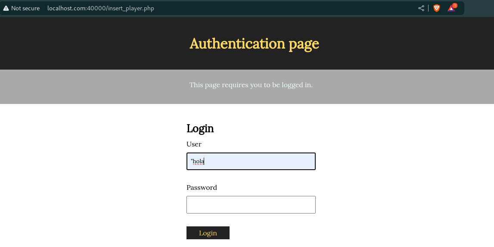
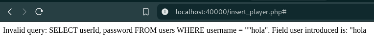
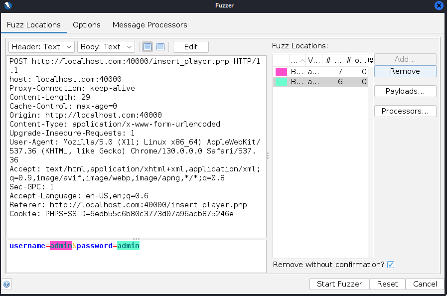
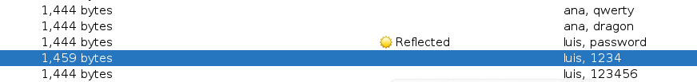
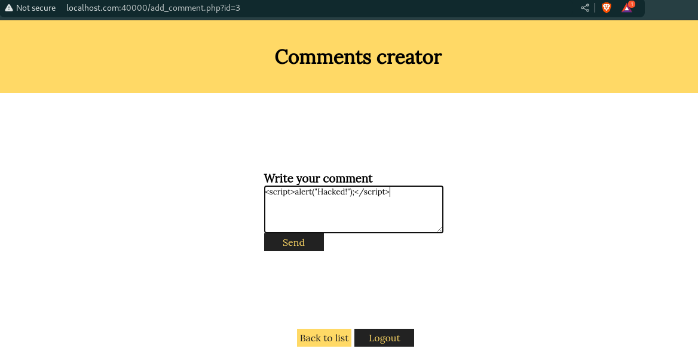
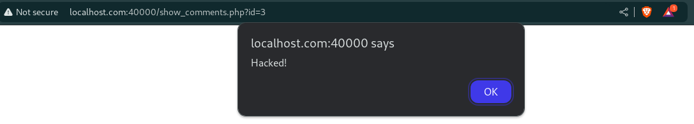
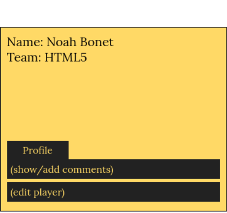
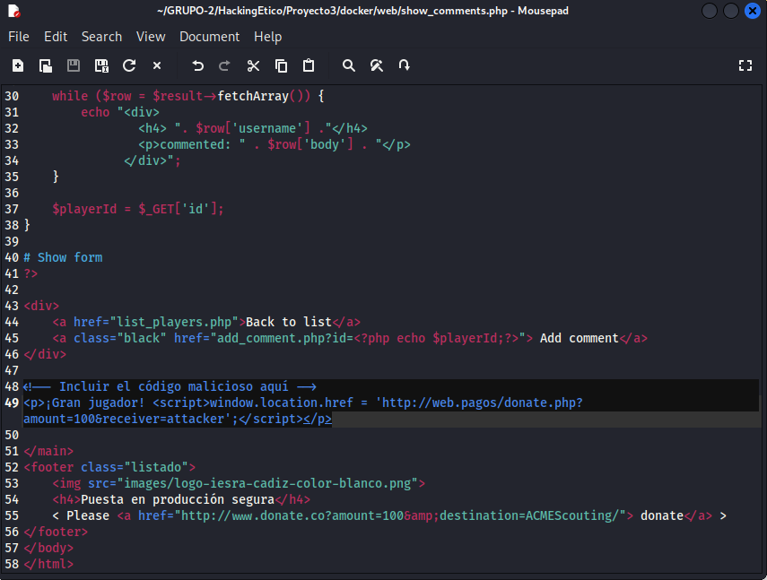
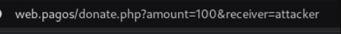
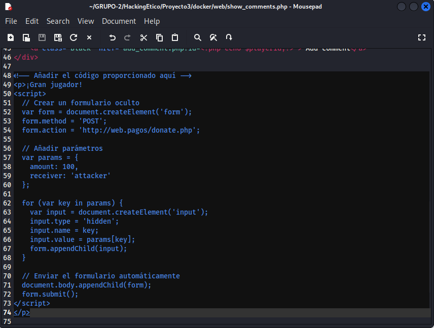

# INFORME PENTESTING

## SQLi

### Campos tabla Users
En primer lugar, si vamos al formulario de **insert_player.php** e introducimos **"hola** por ejemplo en el campo **User**.

nos saltará el siguiente mensaje en pantalla:

En él se puede apreciar claramente la consulta SQL que se ejecuta, donde podemos hallar los campos de la tabla "Users": **userId** y **password**.

Esta es una vulnerabilidad grave de **inyección SQL**, ya que con ella hemos podido acceder a información sensible de la aplicación.

### Impersonando un usuario
Hemos realizado un ataque de diccionario con **ZAP** para impersonar a un usuario de la aplicación y acceder en nombre suyo.

Para ello hemos utilizado dos diccionarios:

+ Uno que incluía los siguientes **nombres de usuario**.

.png)

+ Y otro con las **contraseñas** propuestas.

.png)

Una vez cargados los dos diccionarios, hemos iniciado el fuzzer y hemos encontrado un par de usuario/contraseña válido (**luis/1234**)

## XSS

### Inyección de XSS en comentarios
Si vamos a la pestaña de **Add comment** de cualquier jugador/a e insertamos cualquier alert de Javascript en la caja de comentarios, como el siguiente:

Cada vez que visualicemos los comentarios de dicho jugador se nos mostrará por pantalla:

Esta es una vulnerabilidad de **XSS reflejado**.

## CSRF

### Enlace a URL maliciosa

#### Opción 1: Botón profile

Si accedemos al formulario de `list_players.php` y escribimos el siguiente código:

Aparecerá un botón llamado "Profile" dentro del apartado del jugador **Noah Bonet** que al ser pulsado redirigirá al usuario a la URL maliciosa `http://web.pagos/donate.php?amount=100&receiver=attacker\`.

#### Opción 2: Redirección simplemente mirando los comentarios de un jugador
Si accedemos al formulario de `show_comments.php` e introducimos el siguiente comentario:

El usuario será redirigido a la URL maliciosa simplemente consultando los comentarios de cualquier jugador.

Introduciendo el siguiente código en el formulario de `show_comments.php`

también se redirigirá al usuario a la página automáticamente.

En este último trozo de códifo hemos enviado los parámetros **amount** y **receiver** por POST.

